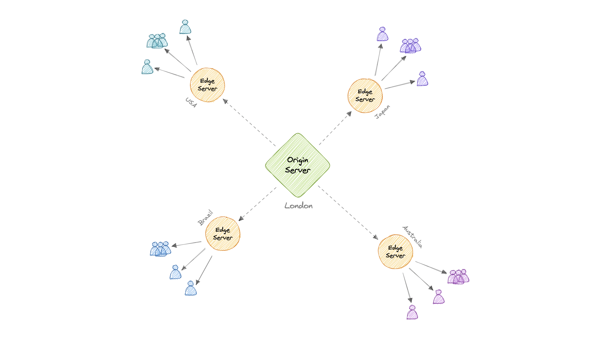

# Content Delivery Network (CDN)

A **content delivery network (CDN)** is a geographically distributed group of servers that work together to provide fast delivery of internet content. Typically, static files such as HTML, CSS, JavaScript, photos, and videos are served from a CDN to enhance the performance of websites and applications.

## Why Use a CDN?

A CDN increases **content availability**, provides **redundancy**, and reduces **bandwidth costs**. It also improves security by serving cached content. Performance is significantly improved as users receive content from servers located closer to them, reducing the load on origin servers.

## How Does a CDN Work?

In a CDN setup, the **origin server** contains the original content, while **edge servers** are distributed across various global locations. To reduce latency, a CDN caches the website's content at these edge locations. When a user requests content, they receive it from the nearest edge server rather than the distant origin server, improving speed and reducing the load on the origin.

For instance, if someone in the UK requests a website hosted in the USA, the request will be fulfilled by the closest edge server (e.g., London), significantly reducing latency compared to a direct request to the origin server.

## Types of CDNs

### 1. Push CDNs

In a **push CDN**, new content is pushed to the CDN servers whenever changes occur on the origin server. We are responsible for uploading content and rewriting URLs to point to the CDN. Push CDNs work well for websites with small traffic or content that is infrequently updated, as content is uploaded only when new or changed, which minimizes traffic but uses more storage.

### 2. Pull CDNs

In a **pull CDN**, the CDN updates its cache based on client requests. When a request is made and the CDN does not have the required assets, it fetches them from the origin server, caches them, and delivers them to the user. Pull CDNs are better suited for websites with high traffic, as only frequently requested content is cached, reducing maintenance.

## Disadvantages of CDNs

While CDNs provide many benefits, they come with some disadvantages:

- **Cost**: Using a CDN can be expensive, especially for high-traffic services.
- **Restrictions**: Some organizations or countries may block certain CDN domains or IP addresses.
- **Location limitations**: If the audience is primarily located in a country without CDN servers, using a CDN might increase latency instead of reducing it.

## Examples of Popular CDNs

- [**Amazon CloudFront**](https://aws.amazon.com/fr/cloudfront/)
- **Google Cloud CDN**
- **Cloudflare CDN**
- **Fastly**
